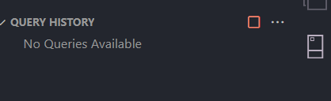
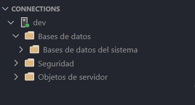

# GESTION DE CONTABILIDAD 

### ¿Cómo correr el aplicativo?
Antes de iniciar, se necesita validar los siguientes requerimientos para poder correr el servicio:
1. Tener instalado DOCKER
2. Tener instalado NODE.JS
3. Tener instalado pnpm

Ahora si, podemos iniciar la configuración de nuestro servidor, para ello seguir los siguientes pasos:
1. Configurar el "host" y el "port" en el archivo .env (hay un archivo llamado ".env_example" que tiene el ejemplo de las variables de entorno)
2. Si es la primera vez, instala el contenedor con tu contraseña de docker usando el siguiente comando:<br>
```docker run -e "ACCEPT_EULA=Y" -e "MSSQL_SA_PASSWORD=(TU CONTRASEÑA)" -p 1433:1433 -d mcr.microsoft.com/mssql/server:2022-latest```, si no, inicializa docker y corre el contenedor correspondiente
3. Antes de correr el servidor, hay que inicializar la base de datos, en este caso estamos usando la extención de SQL Server
4. Como por ahora solo estamos haciendo pruebas, vamos a crear una nueva Query que contenga lo siguiente ```CREATE DATABASE NOMBRE_DE_LA_DB```
5. Correr el server con el comando ``pnpm dev``

## CAMPOS EN LA DB

En nuestra base de datos llamda `Passwords_contability_gestion`, vamos a manejar las tablas:

### USERS TABLE `us333rs_`

| Name                | Db_name                     | Decripción |
|---------------------|-----------------------------|------------|
| id              | ``us333rs__id``             | ``id único``     |
| name            | ``M4m3``                    | ``string``     |
| lastname        | ``l4Z_TM4m3``               | ``string``     | 
| email           | ``n_ail``                   | ``unique email``     | 
| emergency_email | ``3m3rg3nzy__3m4il``        | ``unique email`` No puede ser el mismo que ``email``    | 
| password        | ``ppp3sswo_rd``             | ``string`` ``min 8 carácteres``     | 
| phone           | ``_Pg_0Me``                 | ``BigInt``     | 
| role            | ``lo_58role``               | ``id rol``     | 
| creation_date   | ``cr1ea5tiq123on_d__ate``   | ``dateTime``     | 
| update_date     | ``up352te_Dat32``           | ``dateTime``     | 


### Roles: `ro6520l_e57s` 
Por ahora esta tabla está validada para aceptar solo y únicamente 3 roles: ``SUDO, ADMIN, User`` 
| Name          | Db_name                   | Description           |
|---------------|---------------------------|-----------------------|
| id            | ``rR0__l3_id``            | `id único`            |
| rol_name      | ``rR0__l3_M4m3``          | `rol único` `solo 3`  |
| decription    | ``de_12scr1PAt_on``       | `string`              |
| creation_date | ``cr1ea5tiq123on_d__ate`` | `dateTime`            |
| update_date   | ``up352te_Dat32``         | `dateTime`            |

<br>

# Creación de la Base de Datos
Vamos a correr cada uno de los siguientes codigos SQL. Luego de cada uno de ellos vamos a darle en el siguiente botón de color verde que aparece en la parte superior derecha de la ventana de VSCode:

1. Correr el archivo llamado `./database/database.sql` para crear todas las tablas
2. Correr el archivo `./database/trigger_login.sql` para crear los triggers necesarios
3. Realizar la inserción de datos de prueba en `./database/queries.sql`

<br>

# NOTAS
1. <b>Inserción de datos en SQL</b>: Si vas a insertar datos en la DB, no olvides que las consultas si o si deben ser realizadas con comillas simples, eso si se hace directamente desde un archivo ".sql" 

2. <b>IMPORTANTE:</b> Las tablas no pueden empezar por una mayúscula
<br>
<br>

# ERRORES
Alguno de los problemas que se pueden presentar, es que no podamos borrar la base de datos, para ello hay muchas formas de resolverlo, pero para mí, la más eficiente es la siguiente
```sql
USE master; -- Cambia a la base de datos master para liberar la que quieres eliminar
ALTER DATABASE Passwords_contability_gestion SET SINGLE_USER WITH ROLLBACK IMMEDIATE;
DROP DATABASE Passwords_contability_gestion;
```

<b>En caso de que ocurra un error por los permisos del usuario "sa", puede ser por las siguientes causas</b>:
1. Verificar la constraseña en las configuraciónes de la base de datos en el archivo `src/utils/util.ts`
2. Verificar que el nombre de la base de datos sea el correcto

### <b>Si ninguna de las anteriores solucionó el error, hacer lo siguiente:</b>
1. Eliminar el contenedor donde se encuentra almacenada la base de datos
2. Volver a crear el servidor con el comando que se encuentra en el paso 2 de ``cómo correr el aplicativo``
3. Guardar la contraseña ya que la vamos a usar más adelante
4. usando la extención ``SQL SERVER`` vamos a crear una nueva conexión y vamos a ponerle el nombre que querramos, el host, vamos a marcar la casilla de  ``Trust server certificate``, elegimos la opción "SQL Login", ingresamos como nombre de usuario ``sa`` e introducimos la contraseña que habíamos guardado anteriormente. Opcional: marcar la casilla "save password" para guardar tu contraseña.
5. Habiendo generado la conexión, vamos a abrir la extensión que tiene el siguiente icono: 

Luego de ello vamos a crear la base de datos de nuevo la base de datos dando click derecho donde dice "dev": 

Puede que a ti te salga otro nombre, pero los pasos son los mismos.
Luego de ello vas a darle click en `NEW QUERY`
Donde se te va a llevar a un archivo SQL vacío.
Allí vas a volver a crear la base de datos según los pasos en ``"CREAR LA BASE DE DATOS"``